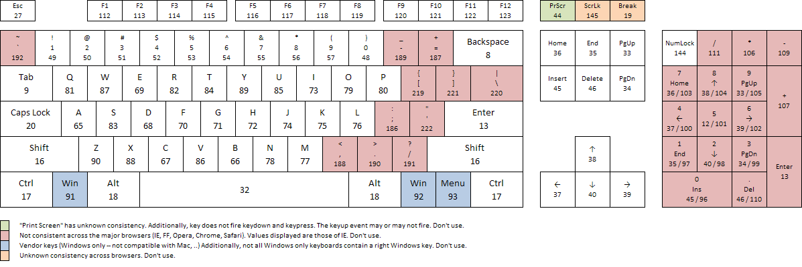

## 1 - Dars

### 1. *Ma'lumotlarni kirgizishlik va chiqarishlik* 

####  **input  and  output**

- input
  - prompt
- output
  - alert
  - confirm

### 2. *Malumotlarni js orqali dacumentga qo'shishlik*  
```
a = prompt ("ismingizni kiriting");
console.log(window);
text=window.document.getElementById("id nomi");
//text.innerHTML="<i>nimadur</i>";
//text.inneText="nimadur....";
text.textContent = a + " nimadur ";
consile.log(text);

```  
### 3. *Consol turlari*
- **console.worn("...");** -> *qandaydur hatolik haqida ogohlantimoqchi bo'lsak.* 
- **console.error(".....");**  -> *hatolik haqida ogohlantirishlik bermoqchi b'lsak.* 
- **consile.din("...");** -> *to'grida to'gri yozgan malumotimizni chiqarishlik uchun.*
- **console.table("...");** ->*jadval ko'rinishida chiqarberadi malumotlarimizni.*

### 4. *Syntax and comments*
- comeents ( **//** and  **/ * .... * /** )
- statement and semicolon **;**
- Block { }
- Experssion 4+6 
- White spaces (space, new line , tab )

### 5. *O'zgaruvchilar*
- var
- let
- const

### 6. *Data tayp*
**Data tayip js da 8 ta turi mavjud , ular o'zi 2turga bo'linadi primotive va no primotive**

- primotive
  1. number
  2. string
  3. boolean
  4. undefined
  5. null
  6. nigInt
  7. symbol
- no primotive
   
    8. Object
### 7. *O'zgaruvchi nomlash usullari* 
1. camel case -> myName
2. Pascal case -> MyName
3. snace case -> my_name

<hr>

# *JavaScript lesson-2*

## 1. "use strict" 

- **Bu ko'd yozsak js ni oldingi versiyalaridagi bug larni tekshirip yoki aytish mumkun aniqlab berish maqsadida ishlaydi**

## 2. " typeof "

- **Bu functsiya bizga malumotni qaysi turda ekanligini aniqlab beradi**

**M :** 
```
console.log(typeof "Assalomu alekum"); //natija -> string
console.log(typeof 571); //natija -> number

```
## 3. Number

- **Bizqachonki o'zgaruvchiga qimat sifatida son kiritsak u number bo'ladi . M: ( 1 , 2333 , 0.34 , -34 , ... )**

```
console.log(1 / 0); //--> Infinity
```
 
 - **Infinity - bu cheksizlik**

 ```
 console.log("64"/2); //--> 32
 ```
 - **Yuqoridagi misolda ko'rishligimiz mumkun ' taype conversin ' yani malumot turi o'zgaryapti string numberga o'zgaryapti.**


 ```
 console.log(45+true);  //-> 46 
 console.log(45-true);  //-> 44 
 console.log(45/true);  //-> 45 
 console.log(45*true);  //-> 45
 console.log(45/folse); //-> Infinity 
 console.log(45+folse); //-> 45 
 console.log(45-folse); //-> 45  
 ```
- **Yuqoridagi misolda ko'rishligimiz mumkun boolen ' taype conversin ' yani malumot turi o'zgaryapti '*true = 1*' , '*folse = 0*' barobar bo'ladi**

 ```
 console.log(true+true+true);        //-> 3
 concole.log(35+undefinned);        //-> NaN 
 concole.log(undefined+undefined); //-> NaN 
 console.log(null+null);          //-> 0 
 console.log(null+2);            //-> 2 
 console.log(null-2);           //-> -2 
 console.log(null/2);          //-> 0 
 ```
- **Yuqoridagi misolda ko'rishligimiz mumkun null ' taype conversin ' yani malumot turi o'zgaryapti matematik qiymati ' 0 ' tenfg bo'ladi ( ' null = 0 ' ).**

```
console.log(0.1+0,2);  // -> 0.300000004  js shunday
console.log(15e4);    // -> 15 0000  -> buerrda ( ' e4=10^4 ' ) barobar.
console.log(15e-3);  // -> 0.015  -> bunda (" 15 / 1000 ") shu ko'rinishda matematik amal bajarilga hisoblanadi.
console.log(15e - 7); // -> 143  -> bunda agar biz " - " oldin va kegin  bo'sh joy tashlasak quydagija ish amalga oshadi ( "150 - 7 = 143 " ) ko'rinishida .
console.log(123_456_345); //-> 123456345 
console.log("5"**2); // -> 25 -> yani bu amal ( ** ) 5^2 degani (5*5=25) ko'rinishida .
```

##  4. String
- Biz har qanday malumotmi quydagi shartli belgilar ichida kiritadiga bo'lsak bu malumot turi **String** deb ataladi  **( "...."  , '.....' , `` ,)** .

```
let ism ="Muhammadaziz";
let familiya  ='Akbarov';
let  yosh = `21`;

consile.log(typeof ism, yosh, familiya); //-> string
```
##  5. Undefined

- Qachonki biz o'zgaruvchi elon qilsagu ammo umga qiymat kiritmasak u **undefined** bo'ladi.

```
let firisName ;
console.log(firistName); // -> undefined
```
##  6. Null
- Qachonki biz ozgaruvchining qiymatiga null yozsak bu null yani ochga ozgaruvchining qiymati yo'q ekanligini aytgan bo'lamiz.

```
let varNeme = null;
consile.log(typeof varName); // -> object chiqaradi bu js bug hisoblanadi aslida esa buni taypi null bo'ladi.
```
##  7. bigInt
- bigInt bu taypga 2^53 katta bo'lga sonlar kiradi

```
let bigIntegr = BigInt(2133448585886969677);
console.log(bigIntegr); //-> 2133448n
console.log(typeof bigIntegr); //-> bigint
```

##  8. Assignment -> O'zlashtirish

```
let a = 25;
let b = 35;
a = a + b;
console.log(a); //-> 60  bunda ( a = 25 + 35 ) ga teng bo'ladi
a += a ; // yani ( a = a + a )  bunda qo'shuluvchi ('a') lar  yuqoridagi ohirgi o'zgarishdan qiymat oladi yani (' a = 60 + 60 ') ko'rinishida bo'ladi .
console.log(a); //-> 120
a /= a ; //yani  a = a / a ; --> a = 120 / 120 korinishida 
console.log(a); // -> ( 1 ) ga  teng bo'ladi.
```

##  9.  ++Increment , --Decrement 
- bunda ++Increment  1 oshirish.
- bunda --Decrement  1 kamaytirish.

```
let a = 23;
let b = 56;
console.log(--a); //--> 22  --> yani bunda 23-1=22 korinishida
console.log(++b); //--> 57  --> yani bunda 56+1=57 korinishida
```
##  10.  Comporison operatoris -> Taqqoslash aperato'rlari 
- taqqoslash aperato'rlari quydagilar ( == , === ,  != , !== , >  , >= , < , <= ). Bunda " == " faqat qiymatlarni tengligini tekshiradi , " ===" bunda nafaqat qiymatlaarni balki tayplarini ham tengligini tekshiradi .

```
console.log(10=="10");      // -> true
console.log(10==="10");     // -> folse
console.log(10===10);       // -> true
console.log("10"==="10");   // -> true
console.log(10>="10");      // -> true
console.log(10!="10");      // -> folse
console.log(10!=="10");     // -> true
console.log("10"!=="10");   // -> folse
console.log(10>10);         // -> folse
```
<hr>

# Lesson-3 <br> Number

##   *1. Math object*

- Math.abs  -> absalyut qiyamt chiqarishlik uchun
- Math.fool -> kichik tamonga yahlitlash M: 12.4 -> 12 , 21.8 -> 21 
- Math.ceele -> katta tamonga yahlitlash M: 12.6 -> 13 , 32.2 -> 33
- Math.round -> rost yahlitlash M: 12.7 -> 13 , 23.4 -> 23
- Math.max/min -> sonlar orasidan eng kattasini va eng kichigini olishlik uchun .
- Math.pow -> songa daraja tayinlashlik M: (2,3)->2^3-> == 8
- Math.sqrt -> ildizdan chiqarish M: kiritgan sonimiz 25 u ildizdan chiqan holatida 5 .
- Math.trunc -> kiritilgan sonnio butun qismini olib beraddi .
- Math.random -> sonlarni random qilib beradi har refresh qilinganda , defoltni holati 0 va 1 oraligida bo'ladi.
<hr>

## *2. Folthy and Truth*
- Folthy ( 0 , folse , "" , null , undefined , Nan , 0n )
- Truth ( 1 , 1234 , 34343523n , "o" , '  ' , "folse" , true , infinit , -infinit , {} , [] , ...............)

## 3. if else -shartli operator
```
let a = +prompt("a sonini kiriting");
let b = +prompt("b sonini kiriting");
if (a % 2 == 1 && b % 2 == 1){
    console.log("siz kiritga ikkala son ham tog son");
}else{
    console.log("sizkiritgan sonlar ten tog bo'lishligi kerak")
}
```

## 4. switsh - taqoslash operatori

```
let a = +prompt("Bahoyingizni kiriting");
if(Number.isInteger(a) && a >0 && a < 6){
    switch (a){
        case 1 :
            console.log(`Sizning bahoyingiz(' ${a} ')  yomon `);
            break;
        case 2 :
            console.log(`Sizning bahoyingiz(' ${a} ')  qoniqarsiz `);
            break;
        case 3 :
            console.log(`Sizning bahoyingiz(' ${a} ')  qoniqarli `);
            break;
         case 4 :
            console.log(`Sizning bahoyingiz(' ${a} ')  yahshi `);
            break;
        case 5 :
            console.log(`Sizning bahoyingiz(' ${a} ')  alo `);
            break;   
    }
}else{
    console.log("Xato !");
}
```

<hr>

## 1. SCOPE
- GLOBAL SCOPE
- LOCAL OR FUNCTION SCOPE
- BLOCK SCOPE 

###  1.1 GLOBAL SCOPE
```
// let a = 3;
// var b = 4;
// const c = 5;

// if (true) {
//   console.log(a);
//   console.log(b);
//   console.log(c);
// }

// switch (a) {
//   case 3:
//     console.log(a);
//     console.log(b);
//     console.log(c);
//     break;
// }
```


### 1.2  LOCAL OR FUNCTION SCOPE
```
// function add() {
//   let a = 3;
//   var b = 4;
//   const c = 5;
// }

// add();

// console.log(a);
// console.log(b);
// console.log(c);

```

### 1.3  BLOCK SCOPE
```
// if (true) {
//   var a = 3;
//   let b = 4;
//   const c = 5;
// }

// console.log(a);
// console.log(b);
// console.log(c);

// let a;
// if (true){
//   a = 3
// }
// console.log(a);

// const a = 3;
// if (true) {
//   const a = 4;
//   console.log(a);
// }
// console.log(a);

```
## 2.  L O O P 
- FOR LOOP
- WHILE LOOP
- DO-WHILE LOOP
  
### 2.1 FOR LOOP
```
// for (initializer; condition; iterator) {
//   // statements
// }

// for (let i = 1; i <= 10; i++) {
//   console.log(i);
// }

// for (let i = 2; i <= 10; i += 2) {
//   console.log(i);
// }
```

### 2.2 WHILE LOOP

```
 // while (condition) {
//   // code block to be executed
// }

// let i = 1;
// while (i <= 10) {
//   console.log(i);
//   i++;
// }

// let count = 1;

// while (count <= 10) {
//   console.log(count);
//   count += 1;
// }
```

### 2.3 DO-WHILE LOOP

```
// do {
//   statement;
// } while (condition);

// let i = 11;
// do {
//   console.log(i);
//   i++;
// } while (i <= 10);

```

```
// ----- L O O P ----- /////////////////
// FOR LOOP /////////
// for (initializer; condition; iterator) {
//   // statements
// }

// for (let i = 1; i <= 10; i++) {
//   console.log(i);
// }

// for (let i = 2; i <= 10; i += 2) {
//   console.log(i);
// }

// WITHOUT INITIALIZER ///
// let j = 1; // initilizer
// for (; j <= 10; j += 1) {
//   console.log(j);
// }

// WITHOUT CONDITION ///
// for (let j = 1; ; j += 1) {
//   console.log(j);
//   if (j > 10) {
//     break;
//   } // condition
// }

// WITHOUT ITERATOR ///
// for (let j = 1; j <= 10; ) {
//   console.log(j);
//   j += 1; // iterator
// }

// WITHOUT ANY EXPRESSION ///
// let j = 1; // initilizer
// for (;;) {
//   if (j <= 10) {
//     console.log(j);
//   } // condition
//   j += 1; // iterator
// }

// WITHOUT LOOP BODY ///
// for (let i = 0; i <= 10; i++, console.log(i));

// for (let i = 1; i <= 10; i++) {
//   console.log(i);
// }

// WHILE LOOP ///////////////
// while (condition) {
//   // code block to be executed
// }

// let i = 1;
// while (i <= 10) {
//   console.log(i);
//   i++;
// }

// let count = 1;

// while (count <= 10) {
//   console.log(count);
//   count += 1;
// }

// DO-WHILE LOOP ////
// do {
//   statement;
// } while (condition);

// let i = 11;
// do {
//   console.log(i);
//   i++;
// } while (i <= 10);

//  SECRET NUMBER GAME //////////////////////////////////////
// generate a secret number between 1 and 10
// const MIN = 1;
// const MAX = 10;

// let secretNumber = Math.floor(Math.random() * (MAX - MIN + 1)) + MIN;

// let guesses = 0; // for storing the number of guesses
// let hint = ''; // for storing hint
// let number = 0;
// do {
//   // get input from user
//   let input = prompt(`Please enter a number between ${MIN} and ${MAX}` + hint);

//   // get the integer
//   number = parseInt(input);

//   // increase the number of guesses
//   guesses++;

//   // check input number with the secret number provide hint if needed
//   if (number > secretNumber) {
//     hint = ', and less than ' + number;
//   } else if (number < secretNumber) {
//     hint = ', and greater than ' + number;
//   } else if (number == secretNumber) {
//     alert(`Bravo! you're correct after ${guesses} guess(es).`);
//   }
// } while (number != secretNumber);

//
// for (let i = 0; i < 5; i++) {
//   console.log(i);
//   if (i == 2) {
//     break;
//   }
// }

// let i = 0;

// while (i < 5) {
//   i++;
//   console.log(i);
//   if (i == 3) {
//     break;
//   }
// }

// CONTINUE //////////////////////
// for (let i = 1; i <= 10; i++) {
//   if (i % 2 !== 0) {
//     continue;
//   }
//   console.log(i);
// }

// let i = 0;
// while (i < 10) {
//   i++;
//   if (i % 2 === 0) {
//     continue;
//   }
//   console.log(i);
// }

```

<hr>

# lesson-6
##   F U N C T I O N S 
### *Funksiya - JavaScript dasturlash tilining asoslaridan biri bo'lob uning yordamida malum bir vazifani bajarish mumkun . Funksiya boshqa bir kod qismida chaqirilganda ishga tushadi . Funksiya yordamida kodni qayta ishlatishlik imkoni mavjud yani birmarotaba elon qilib , bir necha joyda ishlatishlik imkoni mavjud , o'hshati lozim bo'lsa SCSS degi mixsend larga qisman o'hshab ketadi .*
- FUNCTION DECLARATION

### *Funksiyani elon qilish mahsus  "function" kalit so'zi yordamoda elon qilinadi , kegingi qadamda unga nom beriladi "functionName"  keginchalik ishlatmoqchi bo'lsak shu nom bilan chaqirib olamiz , va uning parametirlari "(parameters)" qavuslar ichida yoziladi so'ngra "{// function body}" to'lqinsimon qavuslar ichida fuksiyamizning body qismini yozamiz.*
```
// FUNCTION DECLARATION ///
// function functionName(parameters) {
//   // function body
// }

// function say() {
//   console.log('Hello world !');
// }
// say();  // => Hello world !
// say();  // => Hello world !
// say();   // => Hello world !
// say();   // => Hello world !
// say();   // => Hello world !
```

- RETURN
```
// function say(m) {
//   console.log(m);
//   return m.toUpperCase();
//   // console.log('Salom');
// }

// let result = say('Hello');
// console.log('Result:', result);

// Hello
// Result: undefined
```

- ARROW FUNCTION 

```
// const add = (a, b) => {
//   return a + b;
// };

// const add = (a, b) => a + b;

// // const add = (x, y) => { return x + y; }; // block bo'lsa return ham bo'ladi.
```

<hr>

# **Lesson - 7**  <p>*Takrorlash*</p>
## 1. Nullish colisin operator ( " ?? " )

- *Nullish coalescing (??) operatori mantiqiy operator bo‘lib, uning chap tomonidagi operand null yoki undefained bo‘lsa, o‘ng tomoni operandini qaytaradi, aks holda chap tomonidagi operandni qaytaradi.*
```
console.log(null ?? "Yes"); 
// natija bizga -> (Yes) - chiqadi.
```

## 2. Conditonal operators
 1. - if , else
 2. - if , else if , else
 3. -  ternary operator
 4. - switch case
 </br>
 </br>


###   **if else**
- *If...else buyrug'i, agar ko'rsatilgan shart haqiqat bo'lsa, co'dni bajaradi. Agar shart noto'g'ri bo'lsa, ixtiyoriy else bandidagi boshqa co'dni bajariladi.*
<p>Syntax</p>

```
if (condition) {
  statements1
} else {
  statements2
}
```
###   **if , else if , else**
- *"if , else if , else " qachonki biz birnechta shart beradigan bo'lsak quydagi metodan foydalanamiz shartli operatorda. Bunda biz ( else if ) - ni ihtiyori sitaqanimizcha qo'llansak bo'ladi* 
```
let a = +prompt("son kiriting");

if(a==1){
    console.log(`${a} - kun duyshanba`);
}else if(a==2){
    console.log(`${a} - kun siyshanba`);
}else if(a==3){
    console.log(`${a} - kun chorshanba`);
}else if(a==4){
    console.log(`${a} - kun payshanba`);
}else if(a==5){
    console.log(`${a} - kun juma`);
}else if(a==6){
    console.log(`${a} - kun shanba`);
}else if(a==7){
    console.log(`${a} - kun yakshanba`);
}else {
    console.log(`${a} - bunday hafta kuni yo'q`);
}
```
###   **ternary operator**
- *ternary operator - ham ishlash sintaksisti pashti  " if else" operatoriga o'hshash , buni misolda ko'rsak tushunish yanada osonroq .*
```
let cond = 1;
console.log(cond ? "Yas" : "No"); // ==> Yes

// cand true bolsa "yes" ni false bo'lga holda "no" ni chiqarberdi
```

### **Switch case**
- *Switch operatori ifoda qiymatini bir qator holatlar bandlariga mos keladigan ifodani baholaydi va birinchi case bandidan keyin mos qiymatga ega bo'lgan gaplarni break iborasi topilmaguncha bajaradi. Agar iboraning qiymatiga hech qanday registr mos kelmasa, switch iborasining standart bandiga oʻtiladi.*

<p>M:</p>

```
let a = +prompt("Bahoyingizni kiriting");
if(Number.isInteger(a) && a >0 && a < 6){
    switch (a){
        case 1 :
            console.log(`Sizning bahoyingiz(' ${a} ')  yomon `);
            break;
        case 2 :
            console.log(`Sizning bahoyingiz(' ${a} ')  qoniqarsiz `);
            break;
        case 3 :
            console.log(`Sizning bahoyingiz(' ${a} ')  qoniqarli `);
            break;
         case 4 :
            console.log(`Sizning bahoyingiz(' ${a} ')  yahshi `);
            break;
        case 5 :
            console.log(`Sizning bahoyingiz(' ${a} ')  alo `);
            break;   
    }
}else{
    console.log("Xato !");
}
```

## 3. Loop types

- for
- whil
- do while

### for
- *For operatori qavs ichiga olingan va nuqta-vergul bilan ajratilgan uchta ixtiyoriy ifodadan iborat bo‘lgan sikl hosil qiladi, undan keyin esa siklda bajarilishi kerak bo‘lgan bayonot (odatda blok ifodasi).*

<p>M:</p>

```
let n = 9;
for (let i = 0; i < n; i++) {
  console.log(i);
}
// ==> 0,1,2,3,4,5,6,7,8
```

### while

- *while iborasi sinov sharti rost deb baholansa, belgilangan iborani bajaradigan sikl hosil qiladi. Shart bayonotni bajarishdan oldin baholanadi.*

<p>M:</p>

```
let n = 0;

while (n < 3) {
  console.log(n);
  n++;
}


// natija ==> 0,1,2

```
###  do while
- *Do...while operatori test sharti noto'g'ri baholanmaguncha belgilangan operatorni bajaradigan sikl hosil qiladi. Shart bayonot bajarilgandan so'ng baholanadi, natijada ko'rsatilgan bayonot kamida bir marta bajariladi.Buni yana shoshqoloq loopham diyishadi sabab oldin birinch natijani ko'rsatadi kegin chartga tushadi shartni qanotlantirsa sikl takrorlanadi*

<p>M:</p>

```
let n = 0;
let b = 5;
do {
    console.log(n);
    n++
}while (n <= b);

// natija : 0,1,2,3,4,5

```

## 4.  F U N C T I O N S 
 -  *Funksiya - JavaScript dasturlash tilining asoslaridan biri bo'lob uning yordamida malum bir vazifani bajarish mumkun . Funksiya boshqa bir kod qismida chaqirilganda ishga tushadi . Funksiya yordamida kodni qayta ishlatishlik imkoni mavjud yani birmarotaba elon qilib , bir necha joyda ishlatishlik imkoni mavjud , o'hshati lozim bo'lsa SCSS degi mixsend larga qisman o'hshab ketadi .*

<p>Sintactisti quydagicha :</p>

 ```
 function square(number) {
  return number * number;
}

 ```

<p>M:</p>

```
function power(a,n){
    let b = a**n;
    return b
}

console.log(power(3,2));

// natija ==> 9 
```

### **Naned Functions**
 1. Function declaration
 2. Function expession
 3. Arrow function 
 4. IIFE function  
 5. PIPE function 
 6. CURRYING function 
 7. GENRATOR function 
 8. FACTORY function 
 9. CONTARACTITOR function 
 10. ....
 11. ....
 12. ....
 13. ....
 14. ....
 15. ....

 Bularni ichida eng asosilari 3 tasi ular :
 1. Function declaration
 2. Function expession
 3. Arrow function 


<hr>

# **Lesson-8** <p>*Mavzu:* **Funcsiya , funcsiyanig asosiy 3 ta turi :**</p> <p>*- Function declaration*</p> <p>*- Function expession*</p> <p>*- Arrow function*</p>

## 1.  F U N C T I O N S 
 -  *Funksiya - JavaScript dasturlash tilining asoslaridan biri bo'lob uning yordamida malum bir vazifani bajarish mumkun . Funksiya boshqa bir kod qismida chaqirilganda ishga tushadi . Funksiya yordamida kodni qayta ishlatishlik imkoni mavjud yani birmarotaba elon qilib , bir necha joyda ishlatishlik imkoni mavjud , o'hshati lozim bo'lsa SCSS degi mixsend larga qisman o'hshab ketadi .*

<p>Sintactisti quydagicha :</p>

 ```
 function square(number) {
  return number * number;
}

 ```

<p>M:</p>

```
function power(a,n){
    let b = a**n;
    return b
}

console.log(power(3,2));

// natija ==> 9 
```
### *Function declaration*
- *Funktsiya deklaratsiyasi nima?
Funktsiya deklaratsiyasi funktsiyani belgilaydigan identifikatorni kiritadi va ixtiyoriy ravishda funktsiya parametrlarining turlarini (prototipi) belgilaydi. Funktsiya e'lonlari (ta'riflardan farqli o'laroq) fayllar ko'lami bilan bir qatorda blok doirasida ham paydo bo'lishi mumkin.*

- *Funktsiya declaration qolganlaridan  yanabir kuchli farqi uni elon qilib olganimazdan so'ng istalgan joyda chaqirib ishlata olamiz hatto funksiya elongqilingan satirdan yuqorida chaqirib ham !*

<p>M :</p>

```
function sonBoluvch(n) {
    for (let i = 1 ; i < n ; i++) {
        if(n % i == 0){
            console.log(i);
        }
    }
}
sonBoluvch(10);
```

### *Function expession*
- *Function expession sintaksis jihatdan huddi declaration ohshaydi , asosiy farq bu funksiya nomi bo‘lib yani declarationda biz funcsiyaga nim bergan bo'lsak bunda o'zgaruvchi elon qilib unga funcsiyani elon qilib ketamiz va chaqirib olishda shu o'zgaruvchi nomi bilan chaqirib olamiz , yana bir asosiy farqi uni o'zidan yoqorida chaqira olmaymiz !*

- *Function expession afzalig jihatilaridan biri shuki unu yan ihtiyori bir ozgaruvchiga tenglab , ihtiyoricha o'zlashtirib ishlatishligimiz mumkun , buni 2- misolda ko'rsak yanayam tushunarliroq bo'ladi !*

<p>M :</p>

```
const funcNam = function () {
    console.log("Lesson - 8");
}

funcNam(); // natija ==>  Lesson - 8

// -------------- 2 - misol -----------------

const funcNam = function (a , b) {
    console.log(a+b);
}

funcNam(4,6); // natiga ==> 10

let test = funcNam ;

test(20,67); // ===>  87 
```

### *Arrow function*

- *Arrow function hozirgacha ko'rgan funcsiyalarimiz ichida va umumiy jihatda eng ko'p ishlatladigan funcsiya bo'lib hisoblanadi u ishlash jihatidan avalgi korganlarimiz bilan birhiln ish bajaradi sintacsistida biroz far qiladi unin misolda ko'rsak yanayam tushunarliroq bo'ladi.*

- *Arrow function yana bir avzalligi uni stentminti birdona bo'ladigan bo'lsa uni hechqanday bloc skoplarsiz yan <b>" { } "</b>  yai figurni qavuslarsiz bir qatorning o'zida yozib ketsak ham boladi <b>1- misolda</b> ko'rishligimiz mumkun*

<p>M :</p>

```
// ---------  1- misol  -------

const funcNam = () => console.log("hello");

funcNam(); // natija ===> hello

// -------- 2 misol--------------------------

const funcNam = (a, b , c) => {
    if(a>b && b>c){
        console.log(a+b/c);
    }else{
        console.log(a+b+c);
    }
};

funcNam(20,12,4); // natija ==> 23
```
<hr>


# lesson- 9 <p>Array va String</p>

## 1. Array
- *Array -  bir vaqitning o'zida bir nechta qiymatlarni o'zida saqlashi mumkun bo'lgan obect. uni ikki hil ko'rinishda yaratishlik mumkun : 1- ko'rinishii va eng ko'p qo'lanadiga usul bu ( [ ] ) figurni qavuslar ichida yozishlik , 2- uslibi esa (new) kalit so'zidan foydalanib.* 

<p>M :</p>

```
// 1- misol

let arrayName = ['js' ,'java' , 'go'];

// 2- misol

let arrayName = new Array('js' ,'java' , 'go');

```

### Array'dan element olish
- Array - elementlarini uning indexslaridan foydalanib oloshligimiz mumkun . Array  elementlarining raqamlari ( 0 ) - dan boshlanadi.

<p>M :</p>

```
let arrayName = ['js' ,'java' , 'go'];
console.log(arrayName[0]); // natija ==> js
console.log(arrayName[2]); // natija ==> go
```
### Array'ga  element  qo'shish

-  Array'ga  element  qo'shish uchun " push() " va " ushift() " metodlaridan foydalanishligimiz mumkun . Bunda   " push() " - metodi bizga massivnig ohiridan element qo'shin=b bersa " ushift() " meto'di esa aksincha boshidan element qo'shinb beradi , yaqshiroq tushunishlik uchun misol koramiz. 

<p>M :</p>

```
// push() metodiga misol

let name =  ['js' ,'java'];
name.push('go');
console.log(name); //natija =>  ['js' ,'java' , 'go']

//unshift metodiga misol

let name =  ['java' , 'go'];
name.unshift('js');
console.log(name); //natija =>  ['js' ,'java' , 'go']

```

### Array elemeni ozgartirish

- Array elemeni ozgartirishlik uschun unig index'slaridan foydalansak bo'ladi.

<p>M :</p>

```
let name =  ['js' ,'java' , 'go' ];
console.log(name); //natija =>  ['js' ,'java' , 'go']
name[1]='c++';
console.log(name); //natija =>  ['js' ,'c++' , 'go']

```

### Array elementlarini o'chirish
- Array - elementlarini o'chirishlik uchun "pop( )" va "shift( )"metodlaridan foydalansak bo'ladi , bubda  "pop( )" - metodi massiv ichidagi ohirgi elamentni o'chiradi va o'chirilgan elamentni ham qaytarish imkoni mavjuv bu metodda , "shift( )"- metodi massiv ichidagi boshidagi elamentni o'chiradi va o'chirilgan elamentni ham qaytarish imkoni mavjuv bu metodda.

<p>M :</p>

```
// "pop()" metodi 

const name = ['js' , 'java' , 'go' , 'c++' , 'c#'];
const name2 = name.pop();
console.log(name); // natija => ['js' , 'java' , 'go' , 'c++' ]
console.log(name2); // natija => c#

//----------------------------------------------------------

//"shift()" metodi

const name = ['js' , 'java' , 'go' , 'c++' , 'c#'];
const name2 = name.shift();
console.log(name); // natija => [ 'java' , 'go' , 'c++' , 'c#' ]
console.log(name2); // natija => js
```

### Array uzunligini aniqlash

- Array uzunligini yani uning ichidagi conini aniqlashlik uchun ( lenght ) - hususiyatidan foydalanamiz .

<p>M :</p>

```
const name = ['js' , 'java' , 'go' , 'c++' , 'c#'];
console.log(name.lenght); // natiga ==> 5
```


### concat() Metod
- concat() -metodi ikki yoki undan ortiq arraylarni bitlashtiridshlik uchun ishlatiladi . bu ularni birlashtiradi va natiga qaytaradi .

<p>M :</p>

```
const array1 = [ 1, 4 ];
const array2 = [ 2, 3, 7 , 9 ];
const result = array1.concat(array2);
console.log(result); // natija ==> [1, 4, 2, 3, 7, 9]
```

### indexOf() va lastIndexOf() Metodlari:
- indexOf() belgilangan elementni birinchi marta qaysi indeksda ekanligini qaytaradi, lastIndexOf() esa oxirgi marta qaysi indeksda ekanligini.

<p>M :</p>

```
let fruits = ["apple", "banana", "kiwi", "melon", "banana"];
console.log(fruits.indexOf("banana")); // 1
console.log(fruits.lastIndexOf("banana")); // 4
```

### find() metodi

- find() - metodi birinchi bo;lib shart bajargan array elamentini qaytaradi , kopincha bu metod array ichida meto'd qaytarishlikda ishlatiladi.


<p>M :</p>

```
const result = [1, 4, 2, 3, 7, 9 ];
const findValue = (n) => n === 2 ;
const findValue2= result.find(findValue);
console.log(findValue2); // natiga  => 2 
// agar shartga tushmasa undefaind qaytaradi misol uchun n === 5 korinishini kiritsak.
```
### splice(start, deleteCount, item1, ..., itemN) Metodi:

- splice() metodi massivda belgilangan indeksdan boshlab ma'lum bir soni o'chiradi va/ya yangi element(lar)ni qo'shadi.

<p>M :</p>

```
let fruits = ["apple", "banana", "orange", "grape"];
fruits.splice(2, 1, "kiwi", "melon");
console.log(fruits); // natija ==>  ["apple", "banana", "kiwi", "melon", "grape"]

```
### slice(start, end) Metodi:
- slice() metodi massivning belgilangan oraliqni ko'chirib olish uchun ishlatiladi.


<p>M :</p>

```
let fruits = ["apple", "banana", "kiwi", "melon", "grape"];
let subArray = fruits.slice(1, 4);
console.log(subArray); //natija ==> ["banana", "kiwi", "melon"]

```
### indexOf() va lastIndexOf() Metodlari:
- indexOf() belgilangan elementni birinchi marta qaysi indeksda ekanligini qaytaradi, lastIndexOf() esa oxirgi marta qaysi indeksda ekanligini.


<p>M :</p>

```
let fruits = ["apple", "banana", "kiwi", "melon", "banana"];
console.log(fruits.indexOf("banana")); //natiga =>  1
console.log(fruits.lastIndexOf("banana")); //natiga =>  4

```

### includes() Metodi:

- includes() metodi massivda berilgan elementni qidiradi va mavjud bo'lsa true, aks holda false qaytaradi.

<p>M :</p>

```
let fruits = ["apple", "banana", "kiwi", "melon"];
console.log(fruits.includes("kiwi")); // true
console.log(fruits.includes("grape")); // false
```
### filter(callback) Metodi:
- filter() metodi berilgan shartlarni qondirib, shartlarni bajaradigan elementlarni qaytaradi.


<p>M :</p>

```
let numbers = [10, 25, 5, 40];
let filteredNumbers = numbers.filter(number => number > 20);
console.log(filteredNumbers); //  natija =>### map(callback) Metodi:  [25, 40]

```

### map(callback) Metodi:

- map() metodi massivning har bir elementi uchun berilgan funksiyani bajarib, yangi bir massivni qaytaradi.


<p>M :</p>

```
let numbers = [1, 2, 3, 4];
let squaredNumbers = numbers.map(number => number ** 2);
console.log(squaredNumbers); //natija =>  [1, 4, 9, 16]

```

## 1. String  metodlari

- **String length:** Matn uzunligini qaytaradi.

<p>M :</p>

```
var str = "Hello";
console.log(str.length); // 5

```

- **String charAt():** Berilgan indeksdagi belgini qaytaradi.

<p>M :</p>

```
var str = "Hello";
console.log(str.charAt(1)); // "e"

```

- **String charCodeAt():** Berilgan indeksdagi belgining Unicode qiymatini qaytaradi.

<p>M :</p>

```
var str = "Hello";
console.log(str.charCodeAt(1)); // 101

```

-  **String at():** JavaScript tilida yo'q. CharAt() metodini ishlatish mumkin.

- **String [ ]:** Matndagi belgi indeks orqali qaytariladi.

<p>M :</p>

```
var str = "Hello";
console.log(str[1]); // "e"
```

- **String slice():** Berilgan indekslar orasidagi qismni kesib olish.

<p>M :</p>

```
var str = "Hello, World!";
console.log(str.slice(7, 12)); // "World"
```

-  **String substring():** Berilgan indekslar orasidagi qismni kesib olish (slice bilan bir xil, lekin manfiy indekslar bilan ishlaydi).

<p>M :</p>

```
var str = "Hello, World!";
console.log(str.substring(7, 12)); // "World"
```

- **String substr():** Berilgan indeksdan boshlab belgilangan uzunlikdagi qismni kesib olish. 
<p>M :</p>

```
var str = "Hello, World!";
console.log(str.substr(7, 5)); // "World"
```

- **String toUpperCase():** Matndagi harlarni katta qiladi.
<p>M :</p>

```
var str = "hello";
console.log(str.toUpperCase()); // "HELLO"
```

- **String toLowerCase():** Matndagi harlarni kichik qiladi.
<p>M :</p>

```
var str = "HELLO";
console.log(str.toLowerCase()); // "hello"
```
-  **String concat():** Matnlarni birlashtiradi.
<p>M :</p>

```
var str1 = "Hello";
var str2 = ", World!";
console.log(str1.concat(str2)); // "Hello, World!"
```
- **String trim():** Matndan bosh va oxirgi bo'shliklarni olib tashlaydi.
<p>M :</p>

```
var str = "   Hello, World!   ";
console.log(str.trim()); // "Hello, World!"
```

- **String trimStart():** Matndan bosh bo'shliklarni olib tashlaydi.
<p>M :</p>

```
var str = "   Hello, World!   ";
console.log(str.trimStart()); // "Hello, World!   "
```
- **String trimEnd():** Matndan oxirgi bo'shliklarni olib tashlaydi.
<p>M :</p>

```
var str = "   Hello, World!   ";
console.log(str.trimEnd()); // "   Hello, World!"
```
- **String padStart():** Matni berilgan uzunlikka yettirish uchun boshqa belgi bilan to'ldiradi.
<p>M :</p>

```var str = "5";
console.log(str.padStart(3, "0")); // "005"
```
- **String padEnd():** Matni berilgan uzunlikka yettirish uchun boshqa belgi bilan oxirgi qismini to'ldiradi.
<p>M :</p>

```
var str = "5";
console.log(str.padEnd(3, "0")); // "500"
```
- **String repeat():** Matnni berilgan miqdorda takrorlaydi.
<p>M :</p>

```
var str = "Hello";
console.log(str.repeat(3)); // "HelloHelloHello"
```
- **String replace():** Matndagi bir nechta belgilarni boshqa belgilar bilan almashtiradi.
<p>M :</p>

```
var str = "Hello, World!";
console.log(str.replace("World", "Universe")); // "Hello, Universe!"
```
- **String replaceAll():** Matndagi barcha belgilarni boshqa belgilar bilan almashtiradi (ES2021dan boshlab).
<p>M :</p>

```
var str = "Hello, World!";
console.log(str.replaceAll("l", "X")); // HeXXo, WorXd!
```
- **String split():** Matnni belgilarga ko'ra kesib oladi va massivga o'zlashtiradi.
<p>M :</p>

```
var str = "Hello, World!";
console.log(str.split(", ")); // ["Hello", "World!"]
```

<hr>

# leesson-10
## IIFT function va Array meto'dlari
### 1. IIFT function 

- IIFT function - o'zini o'zi chaqiruvchi funcsiya ham dep atasak bo'ladi sababini esa misolda ko'rib yanayam yahshiroq tushunib olamiz 
<p>M : </p> 

```
(function (arg1 , arg2){
    consile.log(arg1 + arg2);
})(11 ,10); 
// natija => 21 
```

### 2. Array
- *Array -  bir vaqitning o'zida bir nechta qiymatlarni o'zida saqlashi mumkun bo'lgan obect. uni ikki hil ko'rinishda yaratishlik mumkun : 1- ko'rinishii va eng ko'p qo'lanadiga usul bu ( [ ] ) figurni qavuslar ichida yozishlik , 2- uslibi esa (new) kalit so'zidan foydalanib.* 

<p>M :</p>

```
// 1- misol

let arrayName = ['js' ,'java' , 'go'];

// 2- misol

let arrayName = new Array('js' ,'java' , 'go');

```

### Array'dan element olish
- Array - elementlarini uning indexslaridan foydalanib oloshligimiz mumkun . Array  elementlarining raqamlari ( 0 ) - dan boshlanadi.

<p>M :</p>

```
let arrayName = ['js' ,'java' , 'go'];
console.log(arrayName[0]); // natija ==> js
console.log(arrayName[2]); // natija ==> go
```
### Array'ga  element  qo'shish

-  Array'ga  element  qo'shish uchun " push() " va " ushift() " metodlaridan foydalanishligimiz mumkun . Bunda   " push() " - metodi bizga massivnig ohiridan element qo'shin=b bersa " ushift() " meto'di esa aksincha boshidan element qo'shinb beradi , yaqshiroq tushunishlik uchun misol koramiz. 

<p>M :</p>

```
// push() metodiga misol

let name =  ['js' ,'java'];
name.push('go');
console.log(name); //natija =>  ['js' ,'java' , 'go']

//unshift metodiga misol

let name =  ['java' , 'go'];
name.unshift('js');
console.log(name); //natija =>  ['js' ,'java' , 'go']

```

### Array elemeni ozgartirish

- Array elemeni ozgartirishlik uschun unig index'slaridan foydalansak bo'ladi.

<p>M :</p>

```
let name =  ['js' ,'java' , 'go' ];
console.log(name); //natija =>  ['js' ,'java' , 'go']
name[1]='c++';
console.log(name); //natija =>  ['js' ,'c++' , 'go']

```

### Array elementlarini o'chirish
- Array - elementlarini o'chirishlik uchun "pop( )" va "shift( )"metodlaridan foydalansak bo'ladi , bubda  "pop( )" - metodi massiv ichidagi ohirgi elamentni o'chiradi va o'chirilgan elamentni ham qaytarish imkoni mavjuv bu metodda , "shift( )"- metodi massiv ichidagi boshidagi elamentni o'chiradi va o'chirilgan elamentni ham qaytarish imkoni mavjuv bu metodda.

<p>M :</p>

```
// "pop()" metodi 

const name = ['js' , 'java' , 'go' , 'c++' , 'c#'];
const name2 = name.pop();
console.log(name); // natija => ['js' , 'java' , 'go' , 'c++' ]
console.log(name2); // natija => c#

//----------------------------------------------------------

//"shift()" metodi

const name = ['js' , 'java' , 'go' , 'c++' , 'c#'];
const name2 = name.shift();
console.log(name); // natija => [ 'java' , 'go' , 'c++' , 'c#' ]
console.log(name2); // natija => js
```

### Array uzunligini aniqlash

- Array uzunligini yani uning ichidagi conini aniqlashlik uchun ( lenght ) - hususiyatidan foydalanamiz .

<p>M :</p>

```
const name = ['js' , 'java' , 'go' , 'c++' , 'c#'];
console.log(name.lenght); // natiga ==> 5
```


### concat() Metod
- concat() -metodi ikki yoki undan ortiq arraylarni bitlashtiridshlik uchun ishlatiladi . bu ularni birlashtiradi va natiga qaytaradi .

<p>M :</p>

```
const array1 = [ 1, 4 ];
const array2 = [ 2, 3, 7 , 9 ];
const result = array1.concat(array2);
console.log(result); // natija ==> [1, 4, 2, 3, 7, 9]
```

### indexOf() va lastIndexOf() Metodlari:
- indexOf() belgilangan elementni birinchi marta qaysi indeksda ekanligini qaytaradi, lastIndexOf() esa oxirgi marta qaysi indeksda ekanligini.

<p>M :</p>

```
let fruits = ["apple", "banana", "kiwi", "melon", "banana"];
console.log(fruits.indexOf("banana")); // 1
console.log(fruits.lastIndexOf("banana")); // 4
```

### find() metodi

- find() - metodi birinchi bo;lib shart bajargan array elamentini qaytaradi , kopincha bu metod array ichida meto'd qaytarishlikda ishlatiladi.


<p>M :</p>

```
const result = [1, 4, 2, 3, 7, 9 ];
const findValue = (n) => n === 2 ;
const findValue2= result.find(findValue);
console.log(findValue2); // natiga  => 2 
// agar shartga tushmasa undefaind qaytaradi misol uchun n === 5 korinishini kiritsak.
```
### splice(start, deleteCount, item1, ..., itemN) Metodi:

- splice() metodi massivda belgilangan indeksdan boshlab ma'lum bir soni o'chiradi va/ya yangi element(lar)ni qo'shadi.

<p>M :</p>

```
let fruits = ["apple", "banana", "orange", "grape"];
fruits.splice(2, 1, "kiwi", "melon");
console.log(fruits); // natija ==>  ["apple", "banana", "kiwi", "melon", "grape"]

```
### slice(start, end) Metodi:
- slice() metodi massivning belgilangan oraliqni ko'chirib olish uchun ishlatiladi.


<p>M :</p>

```
let fruits = ["apple", "banana", "kiwi", "melon", "grape"];
let subArray = fruits.slice(1, 4);
console.log(subArray); //natija ==> ["banana", "kiwi", "melon"]

```
### indexOf() va lastIndexOf() Metodlari:
- indexOf() belgilangan elementni birinchi marta qaysi indeksda ekanligini qaytaradi, lastIndexOf() esa oxirgi marta qaysi indeksda ekanligini.


<p>M :</p>

```
let fruits = ["apple", "banana", "kiwi", "melon", "banana"];
console.log(fruits.indexOf("banana")); //natiga =>  1
console.log(fruits.lastIndexOf("banana")); //natiga =>  4

```

### includes() Metodi:

- includes() metodi massivda berilgan elementni qidiradi va mavjud bo'lsa true, aks holda false qaytaradi.

<p>M :</p>

```
let fruits = ["apple", "banana", "kiwi", "melon"];
console.log(fruits.includes("kiwi")); // true
console.log(fruits.includes("grape")); // false
```
### filter(callback) Metodi:
- filter() metodi berilgan shartlarni qondirib, shartlarni bajaradigan elementlarni qaytaradi.


<p>M :</p>

```
let numbers = [10, 25, 5, 40];
let filteredNumbers = numbers.filter(number => number > 20);
console.log(filteredNumbers); //  natija =>### map(callback) Metodi:  [25, 40]

```

### map(callback) Metodi:

- map() metodi massivning har bir elementi uchun berilgan funksiyani bajarib, yangi bir massivni qaytaradi.


<p>M :</p>

```
let numbers = [1, 2, 3, 4];
let squaredNumbers = numbers.map(number => number ** 2);
console.log(squaredNumbers); //natija =>  [1, 4, 9, 16]

```

<hr>

# lesson -12<p>Mavzu : Object </p>
 - **Obyekt :** JavaScript obyektga yo'naltirilgan dasturlash tilidir. Obyekt, ma'lumotlarni saqlash uchun bir qator xususiyatlar (properties) va uslublar (methods)ni o'z ichiga oladi. Masalan, document obyekti brauzerda HTML sahifaning elementlariga kirish imkonini beradi.

```
const card = {
    nom : "S class",
    marca : "MersadesBens",
    tez : 360,
    ras : "8l-10l",
    yil : 2001,
    rang : "seri",
    fullHarc : function(){
         console.log(this.marca + " " + this.nom + " " + this.tez  )
    }

}

card.fullHarc
```
## Object Metodlari:
- **Object.keys():** Obyektning xususiyatlarini (property) ro'yxatini qaytaradi.

```
var myObject = { name: 'John', age: 25, city: 'New York' };
var keys = Object.keys(myObject);
console.log(keys); // ["name", "age", "city"]

```
- **Object.values():** Obyektning xususiyatlarining qiymatlarini ro'yxatini qaytaradi.

```
var myObject = { name: 'John', age: 25, city: 'New York' };
var values = Object.values(myObject);
console.log(values); // ["John", 25, "New York"]
```

- **Object.entries():**
Bu metod obyektni bir nechta massivlarga aylantiradi, har biri xususiyat va uning qiymatini o'z ichiga oladi.

```
var myObject = { name: 'John', age: 25, city: 'New York' };
var entries = Object.entries(myObject);
console.log(entries);
// [["name", "John"], ["age", 25], ["city", "New York"]]
```
- **Object.assign():**
Bu metod obyektlarni birlashtirish (merge) uchun ishlatiladi.

```
var obj1 = { a: 1, b: 2 };
var obj2 = { b: 3, c: 4 };
var mergedObject = Object.assign({}, obj1, obj2);
console.log(mergedObject);
// { a: 1, b: 3, c: 4 }
```

- **hasOwnProperty():**
Bu metod obyektning belgilangan xususiyati borligini tekshiradi.

```
var myObject = { name: 'John', age: 25, city: 'New York' };
console.log(myObject.hasOwnProperty('age')); // true
console.log(myObject.hasOwnProperty('gender')); // false
```
- **delete:**
Bu operator obyektning xususiyatini o'chiradi.

```
var myObject = { name: 'John', age: 25, city: 'New York' };
delete myObject.age;
console.log(myObject); // { name: 'John', city: 'New York' }
```

<hr>

# Lesson -13 Uy vazifa :<p>Array metodlari , Object metodlari va Function turlari</p>


### **1. Array**
- *Array -  bir vaqitning o'zida bir nechta qiymatlarni o'zida saqlashi mumkun bo'lgan obect. uni ikki hil ko'rinishda yaratishlik mumkun : 1- ko'rinishii va eng ko'p qo'lanadiga usul bu ( [ ] ) figurni qavuslar ichida yozishlik , 2- uslibi esa (new) kalit so'zidan foydalanib.* 

<p>M :</p>

```
// 1- misol

let arrayName = ['js' ,'java' , 'go'];

// 2- misol

let arrayName = new Array('js' ,'java' , 'go');

```

### Array'dan element olish
- Array - elementlarini uning indexslaridan foydalanib oloshligimiz mumkun . Array  elementlarining raqamlari ( 0 ) - dan boshlanadi.

<p>M :</p>

```
let arrayName = ['js' ,'java' , 'go'];
console.log(arrayName[0]); // natija ==> js
console.log(arrayName[2]); // natija ==> go
```
### Array'ga  element  qo'shish

-  Array'ga  element  qo'shish uchun " push() " va " ushift() " metodlaridan foydalanishligimiz mumkun . Bunda   " push() " - metodi bizga massivnig ohiridan element qo'shin=b bersa " ushift() " meto'di esa aksincha boshidan element qo'shinb beradi , yaqshiroq tushunishlik uchun misol koramiz. 

<p>M :</p>

```
// push() metodiga misol

let name =  ['js' ,'java'];
name.push('go');
console.log(name); //natija =>  ['js' ,'java' , 'go']

//unshift metodiga misol

let name =  ['java' , 'go'];
name.unshift('js');
console.log(name); //natija =>  ['js' ,'java' , 'go']

```

### Array elemeni ozgartirish

- Array elemeni ozgartirishlik uschun unig index'slaridan foydalansak bo'ladi.

<p>M :</p>

```
let name =  ['js' ,'java' , 'go' ];
console.log(name); //natija =>  ['js' ,'java' , 'go']
name[1]='c++';
console.log(name); //natija =>  ['js' ,'c++' , 'go']

```

### Array elementlarini o'chirish
- Array - elementlarini o'chirishlik uchun "pop( )" va "shift( )"metodlaridan foydalansak bo'ladi , bubda  "pop( )" - metodi massiv ichidagi ohirgi elamentni o'chiradi va o'chirilgan elamentni ham qaytarish imkoni mavjuv bu metodda , "shift( )"- metodi massiv ichidagi boshidagi elamentni o'chiradi va o'chirilgan elamentni ham qaytarish imkoni mavjuv bu metodda.

<p>M :</p>

```
// "pop()" metodi 

const name = ['js' , 'java' , 'go' , 'c++' , 'c#'];
const name2 = name.pop();
console.log(name); // natija => ['js' , 'java' , 'go' , 'c++' ]
console.log(name2); // natija => c#

//----------------------------------------------------------

//"shift()" metodi

const name = ['js' , 'java' , 'go' , 'c++' , 'c#'];
const name2 = name.shift();
console.log(name); // natija => [ 'java' , 'go' , 'c++' , 'c#' ]
console.log(name2); // natija => js
```

### Array uzunligini aniqlash

- Array uzunligini yani uning ichidagi conini aniqlashlik uchun ( lenght ) - hususiyatidan foydalanamiz .

<p>M :</p>

```
const name = ['js' , 'java' , 'go' , 'c++' , 'c#'];
console.log(name.lenght); // natiga ==> 5
```


### concat() Metod
- concat() -metodi ikki yoki undan ortiq arraylarni bitlashtiridshlik uchun ishlatiladi . bu ularni birlashtiradi va natiga qaytaradi .

<p>M :</p>

```
const array1 = [ 1, 4 ];
const array2 = [ 2, 3, 7 , 9 ];
const result = array1.concat(array2);
console.log(result); // natija ==> [1, 4, 2, 3, 7, 9]
```

### indexOf() va lastIndexOf() Metodlari:
- indexOf() belgilangan elementni birinchi marta qaysi indeksda ekanligini qaytaradi, lastIndexOf() esa oxirgi marta qaysi indeksda ekanligini.

<p>M :</p>

```
let fruits = ["apple", "banana", "kiwi", "melon", "banana"];
console.log(fruits.indexOf("banana")); // 1
console.log(fruits.lastIndexOf("banana")); // 4
```

### find() metodi

- find() - metodi birinchi bo;lib shart bajargan array elamentini qaytaradi , kopincha bu metod array ichida meto'd qaytarishlikda ishlatiladi.


<p>M :</p>

```
const result = [1, 4, 2, 3, 7, 9 ];
const findValue = (n) => n === 2 ;
const findValue2= result.find(findValue);
console.log(findValue2); // natiga  => 2 
// agar shartga tushmasa undefaind qaytaradi misol uchun n === 5 korinishini kiritsak.
```
### splice(start, deleteCount, item1, ..., itemN) Metodi:

- splice() metodi massivda belgilangan indeksdan boshlab ma'lum bir soni o'chiradi va/ya yangi element(lar)ni qo'shadi.

<p>M :</p>

```
let fruits = ["apple", "banana", "orange", "grape"];
fruits.splice(2, 1, "kiwi", "melon");
console.log(fruits); // natija ==>  ["apple", "banana", "kiwi", "melon", "grape"]

```
### slice(start, end) Metodi:
- slice() metodi massivning belgilangan oraliqni ko'chirib olish uchun ishlatiladi.


<p>M :</p>

```
let fruits = ["apple", "banana", "kiwi", "melon", "grape"];
let subArray = fruits.slice(1, 4);
console.log(subArray); //natija ==> ["banana", "kiwi", "melon"]

```
### indexOf() va lastIndexOf() Metodlari:
- indexOf() belgilangan elementni birinchi marta qaysi indeksda ekanligini qaytaradi, lastIndexOf() esa oxirgi marta qaysi indeksda ekanligini.


<p>M :</p>

```
let fruits = ["apple", "banana", "kiwi", "melon", "banana"];
console.log(fruits.indexOf("banana")); //natiga =>  1
console.log(fruits.lastIndexOf("banana")); //natiga =>  4

```

### includes() Metodi:

- includes() metodi massivda berilgan elementni qidiradi va mavjud bo'lsa true, aks holda false qaytaradi.

<p>M :</p>

```
let fruits = ["apple", "banana", "kiwi", "melon"];
console.log(fruits.includes("kiwi")); // true
console.log(fruits.includes("grape")); // false
```
### filter(callback) Metodi:
- filter() metodi berilgan shartlarni qondirib, shartlarni bajaradigan elementlarni qaytaradi.


<p>M :</p>

```
let numbers = [10, 25, 5, 40];
let filteredNumbers = numbers.filter(number => number > 20);
console.log(filteredNumbers); //  natija =>### map(callback) Metodi:  [25, 40]

```

### map(callback) Metodi:

- map() metodi massivning har bir elementi uchun berilgan funksiyani bajarib, yangi bir massivni qaytaradi.


<p>M :</p>

```
let numbers = [1, 2, 3, 4];
let squaredNumbers = numbers.map(number => number ** 2);
console.log(squaredNumbers); //natija =>  [1, 4, 9, 16]

```
<hr>

### **2. Object** 
 - **Obyekt :** JavaScript obyektga yo'naltirilgan dasturlash tilidir. Obyekt, ma'lumotlarni saqlash uchun bir qator xususiyatlar (properties) va uslublar (methods)ni o'z ichiga oladi. Masalan, document obyekti brauzerda HTML sahifaning elementlariga kirish imkonini beradi.

```
const card = {
    nom : "S class",
    marca : "MersadesBens",
    tez : 360,
    ras : "8l-10l",
    yil : 2001,
    rang : "seri",
    fullHarc : function(){
         console.log(this.marca + " " + this.nom + " " + this.tez  )
    }

}

card.fullHarc
```
### Object Metodlari:
- **Object.keys():** Obyektning xususiyatlarini (property) ro'yxatini qaytaradi.

```
var myObject = { name: 'John', age: 25, city: 'New York' };
var keys = Object.keys(myObject);
console.log(keys); // ["name", "age", "city"]

```
- **Object.values():** Obyektning xususiyatlarining qiymatlarini ro'yxatini qaytaradi.

```
var myObject = { name: 'John', age: 25, city: 'New York' };
var values = Object.values(myObject);
console.log(values); // ["John", 25, "New York"]
```

- **Object.entries():**
Bu metod obyektni bir nechta massivlarga aylantiradi, har biri xususiyat va uning qiymatini o'z ichiga oladi.

```
var myObject = { name: 'John', age: 25, city: 'New York' };
var entries = Object.entries(myObject);
console.log(entries);
// [["name", "John"], ["age", 25], ["city", "New York"]]
```
- **Object.assign():**
Bu metod obyektlarni birlashtirish (merge) uchun ishlatiladi.

```
var obj1 = { a: 1, b: 2 };
var obj2 = { b: 3, c: 4 };
var mergedObject = Object.assign({}, obj1, obj2);
console.log(mergedObject);
// { a: 1, b: 3, c: 4 }
```

- **hasOwnProperty():**
Bu metod obyektning belgilangan xususiyati borligini tekshiradi.

```
var myObject = { name: 'John', age: 25, city: 'New York' };
console.log(myObject.hasOwnProperty('age')); // true
console.log(myObject.hasOwnProperty('gender')); // false
```
- **delete:**
Bu operator obyektning xususiyatini o'chiradi.

```
var myObject = { name: 'John', age: 25, city: 'New York' };
delete myObject.age;
console.log(myObject); // { name: 'John', city: 'New York' }
```
<hr>

### **3. Functions**
 - **pure va inpure functions**
 - **CallBack function**
 - **Closure function**
 - **Lexical environment**
 - **HOF function**
 - **Currying function**
 - **Pipe function**
 - **Factory function**
 - **Generator function**

### 1. pure va inpuri functions

- **Pure function :** Tashqaridagi globol scoptegi hech narsaga tasir o'tqazmasa (mutatsiya qilmasa ozgaruvchilarni) bunday  funcsiya *Pure function* deb ataladi !

<p>M :</p>

```
function create(a, b) {
    return a + b;
}

create(11, 10);
```
- **Inpure function :**- Bu globol scoptegi narsalarga (o'zgaruvchilarga) ta'sir o'tkazsa , mutatsiya qilsa unda bunday funcsiya  *Inpure function*  deb ataladi.

<p>M :</p>

```
let arr = [];

function addElement(a) {
    arr.push(a);
    return arr;
}

addElement(21);
```

### 2. CallBack function
- *CallBack function* - funcsiyani qiymatiga boshqa funcsiyani argument sifatida berib uni o'sha funcsiyani ichida  chaqirsac (clon qilsak) , bunday funcsiya  CallBack function deb ataladi  

```
function funA(test) {
    console.log("function A" + test);
    // 4s
}

function funB(test) {
    console.log("function B" + test);
    // 3s
}

function funC(test, callback1, callback2) {
    console.log("function C" + test);
    callback1("-2 ");
    callback2("-3");
    //1s
}

funC("-1", funB, funA);
```

###  3. Closure function va Lexical environment

- **Closure functions**- bironbir  funcsiya  hatto ichida yana funcsiya bo'lsa ham globol scoptgi bironbir o'zgaruvchini o'zini ichidagi scobda ishlashif=ga dastup yani ruhsat berishi "Closure functions" deb ataladi.
- **Lexical environment** - harqanday funcsiyani ichida hosil qilingan muhut "Lexical environment" diyiladi.
```
let a = "Hello World";

function closure() {
    // let a = "Goodbye World";

    console.log(a);

    function innerFunc() {
        //let a = "GOOD";
        console.log(a);
    }
    innerFunc();
}

closure();
```

### 4. HOF function
- **HOF -> Higher order functions -> Yuqori darajaklik funcsiya**
- *HOF* - funcsiya ichida funcsiya return qilinsa bunday funcsifa "HOF" funcsiya deb ataladi , yani bir funcsiyani ichida ikkinchi funcsiyani elon qilib uni o'sha birinchi funcsiyani ichida returin qilinisk=ligiga aytiladi.
```
let a = "Hello World";

function closure() {
    // let a = "Goodbye World";

    console.log(a);

    function innerFunc() {
        let a = "GOOD";
        console.log(a);
    }
    innerFunc();
}

closure();
```

### 5. Currying function

```
const a = (a) => {
    a += 10;
    return (b) => {
        b++;
        return (c) => {
            c -= 1;
            return (d) => {
                d *= 5;
                return a + b + c + d;
            };
        };
    };
};

console.log(a(1)(2)(3)(5));
```

### 6. Pipe function
 - *Pipe* -  tasclar ketma ketlikda bajarilishi buni yana quvurli ham deb ataladi bunga sabab funcsiyalar bir biriga ulanishligidir.

```
const task1 = (arg) => arg + 10;
const task2 = (arg) => arg / 2;
const task3 = (arg) => arg * 0.007;

const result = task3(task2(task1(10)));

console.log(result);
```

### 7. Factory function 
- *Factory function* "object" - yani obect qurub beruvchi funcsiya , bini misol tariqasida ko'rsak yanaham yahshiroq tushuniib olamiz.
```
const laptop = (name, brand, color, memory, price) => {
    return {
        name,
        brand,
        color,
        memory,
        price,
        getInfo: function () {
            console.log(
                `Full info: Name:${name} , brand: ${brand} , color: ${color} , memory: ${memory} , price: ${price}`
            );
        },
    };
};

let hpEnevyX360 = laptop("envy x360", "hp", "silver", "512GB SSD", 800);
let macBookProM2 = laptop("MacBook Pro M2", "Apple", "Silver", "512GB SSD", 1350);

macBookProM2.getInfo();
hpEnevyX360.getInfo();
```

### 8. Generator function

- *Generator function* bu returin funcsiyani thuddi teskarisiga ohshab ishlaydi , biz funcsiyani birinchi chaqirganimizda bizga birinchi "**yield**" nomli calit cozga berilgan qiymatni qaytaradi , ikkinchi bor funcsiyamizni chaqirganimizda ikkinchi "**yield**" qiymatni v.h.k!


```
function signUpTelegram() {
    yield "telefon raqamingizni kiriting";
    yield "SMS kodni kiriting";
    yield "Tabriklaymiz!";
}

const telegram = signUpTelegram();

// console.log(telegram);
console.log(telegram.next().value);
console.log(telegram.next().value);
console.log(telegram.next().value);
console.log(telegram.next().done);
```

<hr>

# JS DOM

## DOM - Document Object Model

### DOM - Selectors 
1. getElementById('')
2. getElementByTegName('')
3. getElementByClassName('')
4. getElementByName('')
5. qutSelector('')
6. qutSelectorAll('')

- getElementById('')-> bunda biz elamentimizni  " id " nomiorqali tanlab olamiz . 
<p>M :</p>

```
let catd = .document.getElementById('card')
```

- getElementByClassName('')-> bunda biz elamentimizni " class " nomi orqali tanlab olamiz . 
<p>M :</p>

```
let catd = .document.getElementByClassName('card');
```
- getElementByTagName('')-> bunda biz elamentimizni " teg " nomi orqali tanlab olamiz . 
<p>M :</p>

```
let h1 = .document.getElementByTagName('h1');
```

- getElementByName('')-> bunda biz elamentimizni " name " nomi orqali tanlab olamiz . 
<p>M :</p>

```
let catd = .document.getElementName('card');
```
- qutSelector('')-> bunda biz elamentimizni ham " .class , #id , tegName , name " orqali tanlab olishligimiz mumkun  . 
<p>M :</p>

```
let card = document.querySelector(".card");
//----------------------
let card = document.querySelector("#card");
//-----------------------
let card = document.querySelector("h1");
//-------------------------
let card = document.querySelector("card");
```

- qutSelectorAll('')-> bunda biz elamentimizni ham " .class ,  tegName , name " orqali qancha bo'lsa hammasini tanlab  olishligimiz mumkun  . 
<p>M :</p>

```
let card = document.querySelectorALL(".card");
//----------------------
let card = document.querySelectorAll("h1");
//-------------------------
let card = document.querySelectorAll("card");
```

<hr>

### **Tanlab olgan elamentlarimiz ustida bajarishimiz mukun bo'lgan ammallar**

- **element.parentElement** -> bu bizga tanlab olgan elamentimizni parent 'ota' elamentini ko'rsatadi.

- **element.parentElemen.parentElement.parentElement** -> bu bizga tanlab olgan elamentimizni eng katta parent elamentigacha chiqishlik imkonini beradi bu ketma ketlikda yozsak.

- **element.parentNode** -> bu ham bizga *.parentElement* kabi vazifa bajaradi

- **element.nextElementSibling** -> bu bizga tanlab olgan elamentimizdan kegingi elamentni ko'rsatadi.

- **element.previosElementSibling** -> bu bizga tanlab olgan elamentimizdan oldingi elamentni ko'rsatadi.

- **element.chidren** -> bu bizga tanlab olgan elamentimizni icidagin 'bola' elamentini ko'rsatadi.

- **element.firstElementChild** -> bu bizga tanlab olgan elamentimizni ichidagi birinchi  elamentni ko'rsatadi.

- **element.lastElementChild** -> bu bizga tanlab olgan elamentimizni ichidagi ohirgi  elamentni ko'rsatadi.

- **element.style** -> bu bizga tanlab olgan elamentimiz olishi mumkun bo'lga barcha srillarni ( *Object { }*) ro'yhat korinishida ko'rishligimiz mumkun va shu orqali elamentimizni manipulatsiya yani stillarni o'zgartiishimiz yoki qo'shimcha yana stillar qo'shishligimiz mumkun.
<p>M : </p>

```
let element = document.querySelector("h1");
element.style.color = "red";
```
<hr>

### 30.01.2024

- **element.style.cssText** -> foydalangan holda js orqali elamentimizga istakgancha stillarni yozishligimiz mumkun , bunda agr (" " , ' ') qo'shtirnoq va birtirnoqni ichida yozadigan bo'lsak 1 qatorda yozishligimiz kerak agar (` `) bektik ichida yozadigan bo'lsak ancha tartipli ko'rinishda yozishlik imkoni mavjut. 

### JavaScript orqali tanlab olgan elamentlarimizni vizini aniqlash 

1.  .clientWidth
2.  .clientHeeight
3.  .offsetHeeight
4.  .offseWidht
6.  .scrolHeeight
7.  .offsetTop
8.  .offsetLeft
 <hr>

 - **element.clientWidth** - tanlab olgan elamentimiz Width aniqlab beradi bunda borderlar hisomlanmaydi misol tariqasida cardni olsak uni borderi , margin lar hisonlanmastan  Width o'lchab beradi va bizga number qaytaradi. 

 - **element.clientHeeight** - elamentimiz balandligini o'lchab beradi huddi element.clientWidth singari

 - **element.offseWidht** - elamentimizni obshi Width olchab beradi bunda peding , border , scrol bo'lsa ularniham hisoblab beradi va bu ham number qaytaradi.

  - **element.offsetHeeight** - elamentimiz  obshi balandligini o'lchab beradi huddi element.offseWidht singari.

  - **element.scrolHeeight** - elamentimiz  skroli bo'lsa shunin o'lchab beradi .

- **element.offsetTop** - elamentimizni tepadan qancha joy bo'lsa shuni o'lchab beradi.

- **element.offsetLeft** - elamentimizni chaptan (leftan) qancha joy bo'lsa shuni o'lchab beradi.

<hr>

### JavaScripta elament atributlari bilan ishlashlik.

1. getAttribute("");
2. setAttribute("" , "");
1. hasAttribute("");

- **elament.getAttribute("");** - bunda kiritgan elament atribut velyusini olib beradi .

- **elament.setAttribute("","");** - bunda metod oz'ziga ikkita qiymat oladi birinchisi o'zgartirmoqchi bo'lgan atributimiz , ikkinchiqiymat sifatida nimga o'zgartirmoqchi bo'lsak shuni yozamiz.

- **elament.hasAttribute("");** - bunda kiritgan elament atribut tekshiradi bo'lsa true aks holda false qiymat qaytaradi .
<hr>

### JavaScrip da classlar bilan islashlik 

1. className
2. classList

- **elament.className** - bu elamentimiz class nomini olib beradi .

- **elament.classList** - bu bizga lamentimizdagi class larni ro'yhatini array "[ ]" ko'rinishida olib beradi va ozini metodlariga ega ular .  

   - .add()
   - .remove()
   - .contains()
   - .toggle()

     - **elament.classList.add("")** - bu elament classiga kiritga classimizni ko'shadi .

      - **elament.classList.remove("")** - bu elament classlari ichidan kiritgan classimizni o'chiradi  .

       - **elament.classList.contans("")** - bu elament ichida biz kiritgan class bo'lsa true aks holda false qiymat qaytaradi.

        - **elament.classList.toggle("")** - bu biz kiritgan classimiz elamentlar classi ichida bo'lsa o'chiradi , agar yoq bo'lsa qo'shadi.

<hr> 

###  31. 01. 2024

###  Dynamicolly DOM monupulating

 - createElement(tegName);
 - appennd();
 - prepend();
 - after();
 - before();


 1. **createElement(tegName)** -> bizga yangi html elament qurib beradi .

 ```
 let div = document.createElement(div);

 // natija -> <div></div>
 ``` 

 2. **appennd()** -> yaratgan elamentimizni tanlab olgan elamentimiz ichiga joylashtirib beradi , joylashtirishda elamentimizni ohiridan joylashtiradi.

```
let wrapper =document.querySelector('.wrapper');
let card = document.createElement('div');

wrapper.append(card);
```

 3. **prepend()** -> yaratgan elamentimizni tanlab olgan elamentimiz ichiga joylashtirib beradi , huddi 'appennd()' singari farqi bunda joylashtirishda elamentimiz boshidan  joylashtiradi, ikkisini bir vaqitda ishlatilmaydi .

```
 let wrapper =document.querySelector('.wrapper');
  let card = document.createElement('div');

  wrapper.prepend(card);
```
 
 4. **after()** -> yaratgan elamentimizni tanlab olgan elamentimizni pasidan qo'shib beradi.

 
```
   let wrapper=document.querySelector('.wrapper');
   let card = document.createElement('div');

   wrapper.after(card);
 ```

5 . **before()** -> yaratgan elamentimizni tanlab olgan elamentimizni yuqorisidan qo'shib beradi.

```
    let wrapper =document.querySelector('.wrapper');
    let card = document.createElement('div');

    wrapper.before(card);
  
```
<hr>

###  1. 02. 2024

### DOM Events 

- **Events** -> Hodisa 

- **addEventListene()** -> hodisani kuzatib turish , bu o'ziga 3 ta qiymat oladi , lekin ko'pincha 2 ta qiymat beriladi . 1- qiymat sifatida o'ziga hodisa nomini oladi (click , dblclick ,....) , 2- qiymat sifatida esa biz kiritga hodisa yuz berganda bjarilishi kerak bo'lgan funcsiya qiymat sifatida olinadi .

<p>M :</p>

```
let modalWrapper = document.querySelector(".modal_wrapper"),
kirish=document.querySelector("#kirish"),
chiqish=document.querySelector("#chiqish");


kirish.addEventListener("click",()=>{
    modalWrapper.style.display = "block";
    document.body.style.overflow = "hidden";
})


chiqish.addEventListener("click",()=>{
    modalWrapper.style.display = "none";
    document.body.style.overflow = "visible";
});
```

### Mouse events

- **click**
- **dblclick**
- **mouseleave**
- **mousemove**
- **mousedown**
- **mouseleave**
- **mouseente**
- **mouseup**

1. - **click** -> mishkani tanlab olgan elamentimiz ustida 1 marotaba bosishlik hodisasi .

2. - **dblclick** -> mishkani tanlab olgan elamentimiz ustida 2 marotaba bosishlik hodisasi .

3. - **mouseleave** -> mishkani tanlab olgan elamentimiz ustiga olib borgandagi hpodisa .

4. - **mousemove** -> mishkani tanlab olgan elamentimiz ustidan olib qochkanimizda , yani boshqa joyga yo'naltirganimizda yuz beruvchi hodisa .

5. - **mouseleave** -> mishkani tanlab olgan elamentimiz ustida harakatlangan vaqti , bunda mishka tanlab olgan elamentimiz ustida qancha harakat qilsa kiritga funcsiyamiz shuncha marotaba ish bajaradi.

6.  - **mousedown** -> mishkani knopkasi bosilgandagi holat.

7.  - **mouseenter** -> ustiga borganda ishlaydi

6.  - **mouseup** -> mousedown ni  teskarisi.

### Keyboard events
- **keydown**
- **keypress**
- **keyup**

1. - **keydown** -> harbitta kno'pkani bosilishi .

2. - **keypress** -> ( keydown ) bilan birhil ishlaydi faqat bir marotaba bossganda gina ishlaydi.

3. - **keyup** -> bironbir tugmani bosib qo'yinb yubiorishligimiz bilan ishlaydi , va eng tez ishlaydigani ham shu hisoblanadi.

```
// event.target.velyu -> bu har bir hodisa yuz berganda nima bosilganligi haqida habar beruvchi yoki bo'lmasam aytishligimiz mumkun bironbir tugmachani yoki qandaydur elamentni bosganligimizda uning velyusini , qiymaini ko'rsatib beradi

```

```
// event.cod.js -> klavyaturadagi har bir kono'pkani o'z son (raqami) cod sifatida mavjut  jsda.

//event.ceyCode
```

### ceyCod :  


<hr>

#### DOM contene loadede -> Documentimizdagi (html) hamma narsa yuclanib bio'lgandan kegin ishlaydiga event.

#### Loaded -> Umumiy ' DOM 'degi narsalar yuklanish hodisasi

#### Resize -> hayitni kichrayib katayishdagi hodisa , vizni boshqarishdagi .

#### Scrole -> scrol 📜
<hr>
 
### setTimeout ( () => {} , 1000);  -> JavaScriptni o'zini funcsiyasi bo'lib , argument sifatida funcsiya va tayim (vaqit "1000 mls") kiritiladi .

### setInterval ( () => {} , 1000);

```
let loadWrapper = document.querySelector('.load_wrapper');

window.addEventListener('DOMContentLoaded',()=>{
    loadWrapper.style.display = 'flex';
    document.body.style.overflow="hidden";
});

window.addEventListener('load',()=>{

    setTimeout( ()=>{

        loadWrapper.style.display = 'none';
        document.body.style.overflow="visible";

    } , 2000)
  
});
```
<hr>
### 2. 02. 2024 
### JSON -> javascript object nototion  - API , config file uchun ishlatiladi

### API - Api progrsamming inteerface -> Frontend va Becend orasidagi yo'l .

### JSON Methods

1. - **json.strinfy()** -> kiritgan o'zgaruvchimiz array , object , number , boolin  harqandek tipda bo'lishidan qatti nazar bizga **stringa** o'girib beradi.

2. - **json.parse()** ->  **stringdan** avvalgi holatiga qaytaradi , o'zgaruvchimiz array , object , number yoki boshqa tipta bo'lgan bo'lsa avalgi haoliga qaytaradi .

### BROWSER STORAGE

1.  **Locolstoragr**
2.  **Sessiontoragr**
3.  **Cookies**

-  **Locolstoragr** -> O'chami 10 MB , yashash davri cheksiz hich qachon o'chmaydi toki o'zimiz o'chirmagunimzgacha .

-  **Sessiontoragr** -> O'chami 5 MB , yashash davri tab bosib ili (x) bosib sayitdan chiqip ketgungacha ishlaydi ,saqlanadi .

- **Cookies** -> O'lchami 4 KB , yashash davri , saqlash mudati o'zimiz kiritgan vaqitgacha saqlanadi (1 hafta , 1 oy , 1 yil , 100 yil , 100000 yil ,........) .

### METHODS

-  **.setItim(q)**
-  **.getItim(q)**
-  **.removeItim(q)**
-  **.clear()**

1. - **LocalStrage.setItim(q)** ->Malumotni Saqlash yoki Q'shish ->  bu metod o'ziga 2 ta qiymat oladi , 1- qiymat sifatida biz berga nom ihtiyori , 2- qiymat saqlamoqchi yoki qoshmoqchi bolgan o'zgaruvchimiz kiritiladi u (number , array , object , boolin ) tibida bo'lsa sozsiz stringga o'girib olishimiz shart **json.strinfy()** yordamida .

2. - **LocalStrage.getItim(q)** -> Bu meto'd saqlangan malumotni olishlik uchun u oziga qiymat sifatida kiritishda bergan nomimiz oladi va shu nom ostidagi malumotni chiqarib beradi.

3. - **LocalStrage.removeItim(q)** -> Bu metod hotiradan saqlangan maklumotni o'chitish uchun ishlatiladi , o'ziga qiymat sifatida kiritishda bergan nomimiz oladi va shu nom ostidagi malumotni o'chiradi .

4. - **LocalStrage.clear()**  -> Bu ham o'chioradi va qiymat olmaydi sabbab hammasini o'chirib butunlay tozalab yuboradi .

